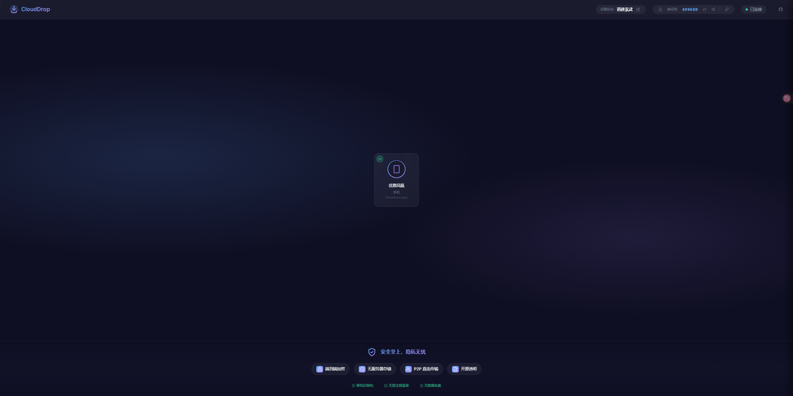
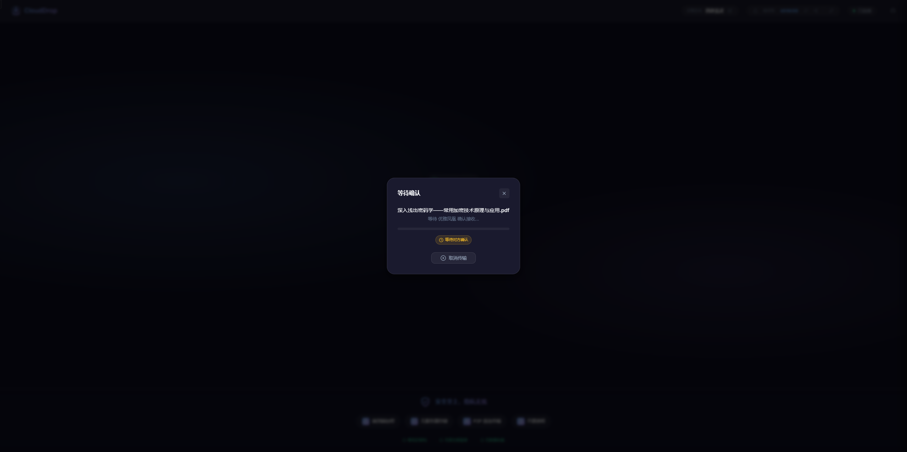
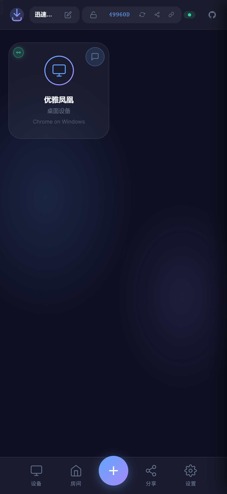
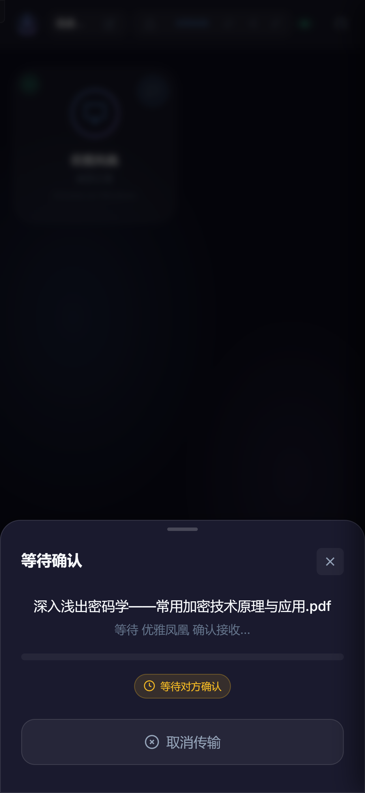

# CloudDrop

<p align="center">
  
</p>

<p align="center">
  <strong>A modern, secure peer-to-peer file sharing tool built on Cloudflare Workers.</strong>
</p>

<p align="center">
  <a href="https://cloudrop.cc">🌐 Live Demo</a> •
  <a href="./README.zh-CN.md">🇨🇳 中文文档</a> •
  <a href="#-features">Features</a> •
  <a href="#-one-click-deploy">Deploy</a> •
  <a href="#️-development">Development</a>
</p>

<p align="center">
  
  
  
</p>

---

## ✨ Features

### Core Features
- 🚀 **Instant Sharing** - Share files with anyone on the same network instantly
- 🔒 **End-to-End Encryption** - All transfers encrypted using AES-256-GCM
- 🌐 **P2P Transfer** - Direct peer-to-peer transfer via WebRTC, no server storage
- ☁️ **Cloudflare Powered** - Built on Cloudflare Workers for global edge deployment
- 📱 **Progressive Web App** - Install as a native app on any device
- 🔗 **Room Sharing** - Share a room code to connect with anyone, anywhere
- 💬 **Secure Messaging** - Send encrypted text messages between devices
- 🎨 **Beautiful UI** - Modern glassmorphism design with light/dark/system theme modes

### Advanced Features
- 🔐 **Encrypted Rooms** - Create password-protected rooms with double encryption
- 🔄 **Smart Relay Fallback** - Auto fallback to relay mode when P2P fails (≤5s detection)
- 🔁 **Background P2P Recovery** - Silently attempts to restore P2P after relay fallback
- ✅ **Device Trust** - Trust devices to auto-accept file transfers
- ⏹️ **Transfer Control** - Cancel ongoing transfers at any time
- 📊 **Connection Indicator** - Visual indicator showing P2P or relay mode
- 📲 **Mobile Optimized** - Touch-friendly UI with bottom navigation bar
- 🖼️ **Image Messaging** - Send and receive images in chat
- 🌍 **Multi-language Support** - Available in 9 languages (English, 简体中文, 繁體中文, 日本語, 한국어, Español, Français, Deutsch, العربية)

## 🖼️ Screenshots

<table>
  <tr>
    <td align="center">
      
      <br><em>Desktop - Peer Discovery</em>
    </td>
    <td align="center">
      
      <br><em>Desktop - File Transfer</em>
    </td>
  </tr>
  <tr>
    <td align="center">
      
      <br><em>Mobile - Main Interface</em>
    </td>
    <td align="center">
      
      <br><em>Mobile - File Transfer</em>
    </td>
  </tr>
</table>

## 🚀 One-Click Deploy

Deploy your own CloudDrop instance to Cloudflare Workers:

[](https://deploy.workers.cloudflare.com/?url=https://github.com/DeH40/cloudDrop)

**Try it first:** Visit [cloudrop.cc](https://cloudrop.cc) to see CloudDrop in action.

## 🛠️ Development

### Prerequisites

- [Node.js](https://nodejs.org/) (v18+)
- [Cloudflare Account](https://dash.cloudflare.com/sign-up) (free tier works)

### Local Development

```bash
# Clone the repository
git clone https://github.com/DeH40/cloudDrop.git
cd cloudDrop

# Install dependencies
npm install

# Start development server
npm run dev
```

The development server will start at `http://localhost:8787`.

### Deploy to Production

```bash
# Login to Cloudflare (first time only)
npx wrangler login

# Deploy
npm run deploy
```

## ⚙️ Configuration

### Optional: TURN Server (for NAT traversal)

For better connectivity across restrictive networks, you can configure Cloudflare's TURN service:

1. Get your TURN credentials from [Cloudflare Dashboard](https://dash.cloudflare.com/?to=/:account/calls)
2. Add secrets to your worker using one of these methods:

**Method 1: Via Cloudflare Dashboard (Recommended)**

1. Go to [Cloudflare Dashboard](https://dash.cloudflare.com/) → Workers & Pages
2. Select your CloudDrop worker → Settings → Variables and Secrets
3. Click "Add" under "Secrets" section
4. Add two secrets:
   - Name: `TURN_KEY_ID`, Value: Your TURN Key ID
   - Name: `TURN_KEY_API_TOKEN`, Value: Your TURN API Token
5. Click "Deploy" to apply changes

**Method 2: Via Command Line**

```bash
npx wrangler secret put TURN_KEY_ID
npx wrangler secret put TURN_KEY_API_TOKEN
```

Without TURN configuration, CloudDrop will use public STUN servers for WebRTC connection.

## 📁 Project Structure

```
cloudDrop/
├── public/              # Static assets
│   ├── index.html       # Main HTML file
│   ├── style.css        # Styles (dark theme + glassmorphism)
│   ├── manifest.json    # PWA manifest
│   └── js/
│       ├── app.js       # Main application logic
│       ├── config.js    # Unified configuration constants
│       ├── ui.js        # UI components & helpers
│       ├── webrtc.js    # WebRTC + relay fallback + P2P recovery
│       ├── crypto.js    # Encryption (AES-GCM + room password)
│       └── i18n.js      # Internationalization (9 languages)
├── src/
│   ├── index.ts         # Worker entry point
│   └── room.ts          # Durable Object for WebSocket rooms
├── wrangler.toml        # Cloudflare Workers configuration
└── package.json
```

## 🔧 Tech Stack

- **Runtime**: Cloudflare Workers + Durable Objects
- **Real-time**: WebSocket for signaling
- **Transfer**: WebRTC Data Channels (P2P) + WebSocket relay (fallback)
- **Encryption**: Web Crypto API (AES-256-GCM, ECDH key exchange)
- **Frontend**: Vanilla JavaScript + Modern CSS
- **i18n**: 9 languages with auto-detection

## 🔒 Security

CloudDrop implements multiple layers of security:

1. **Transport Encryption** - All WebRTC connections use DTLS
2. **Application Encryption** - AES-256-GCM with per-session keys
3. **Key Exchange** - ECDH (P-256) for secure key negotiation
4. **Room Passwords** - Optional password protection with PBKDF2 derivation. Once authenticated, the password is kept in `sessionStorage` so refreshing the page rejoins automatically; it is cleared when the tab closes and never written to `localStorage`.
5. **Zero Knowledge** - Server never sees file contents or encryption keys

## 🌟 Star History

[](https://www.star-history.com/#DeH40/CloudDrop&type=date&legend=top-left)

## 📄 License

[MIT](./LICENSE) © DeH40

---

<p align="center">
  Made with ❤️ for seamless file sharing
</p>
